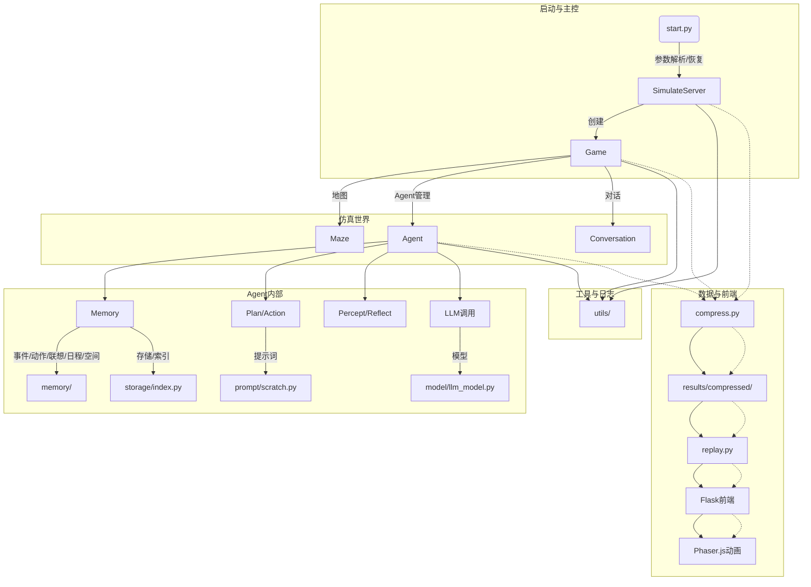
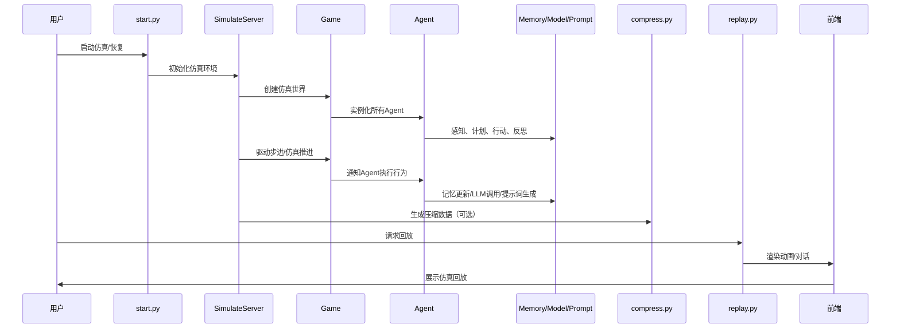
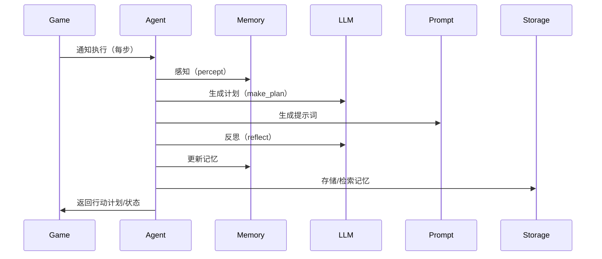
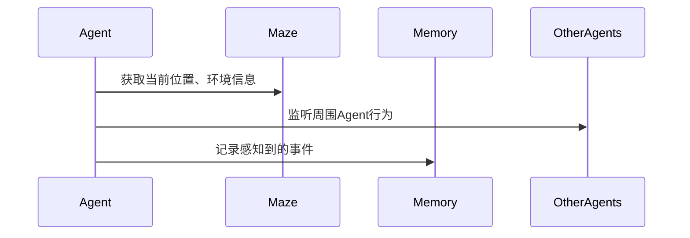
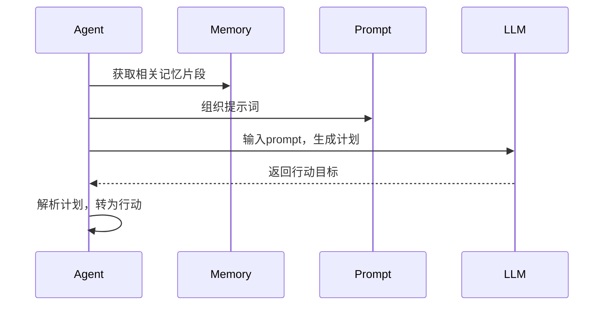
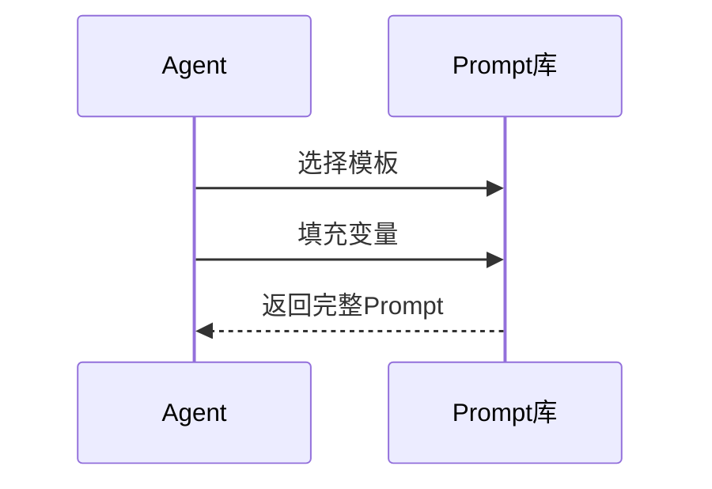
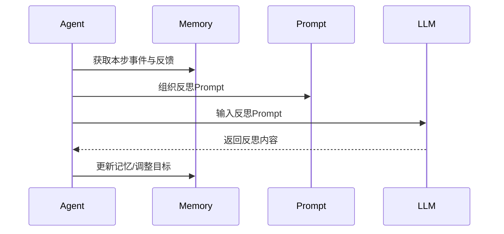
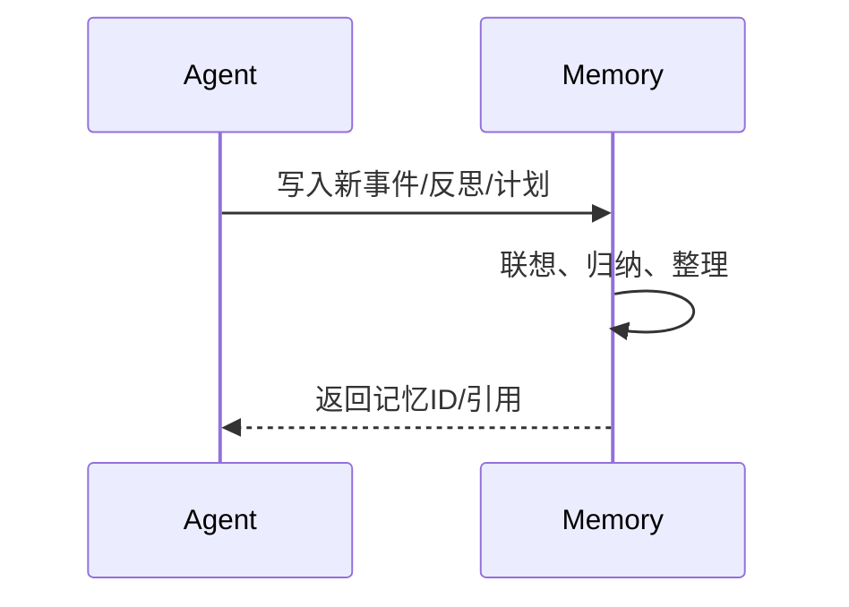
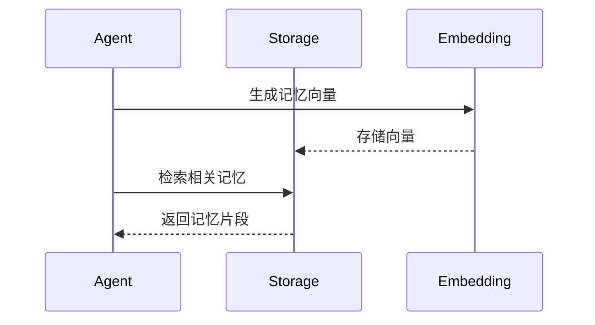
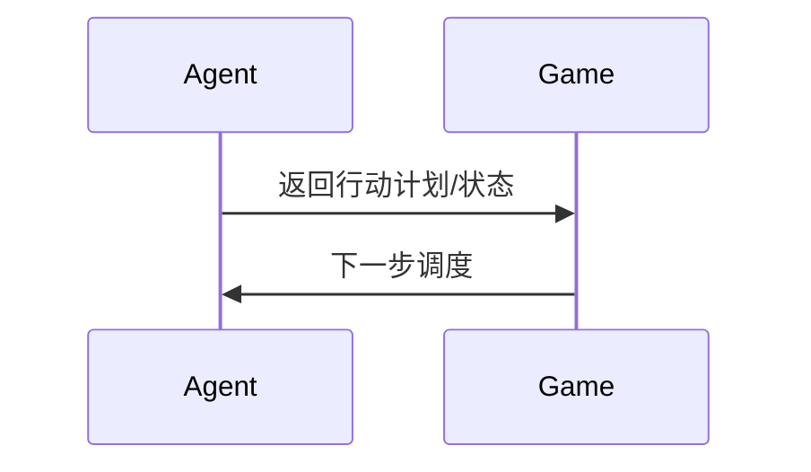

# 项目架构图

## 总体架构与运行逻辑



## 说明

- **主控流程**：`start.py` 负责仿真启动、参数管理、断点恢复，核心仿真由 `SimulateServer` 驱动。
- **仿真世界**：`Game` 负责世界构建，管理所有 agent、地图、对话等。
- **Agent 行为**：每个 agent 拥有独立的记忆、计划、感知、反思等能力，行为决策依赖 LLM、提示词、记忆检索等。
- **记忆系统**：事件、动作、联想、日程、空间等多维度记忆，支持 embedding 检索。
- **数据流**：仿真数据可通过 `compress.py` 压缩，`replay.py` 提供回放服务，前端用 Phaser.js 动画展示。
- **工具与日志**：全局工具、日志、参数、命名空间等由 utils 提供，贯穿各模块。

## 运行时序图



## Agent内部流程时序图



## Agent内部流程详细说明

### 1. 感知（percept）

Agent 感知阶段的内部过程：
- 读取自身状态（如位置、健康、能量等）
- 感知周围环境（如地图、障碍物、地点）
- 感知其他Agent的行为（如对话、动作）
- 生成当前时刻的事件，写入短期记忆



**核心代码片段：**
```python
# modules/agent.py
 def percept(self):
     # 感知环境和自身状态
     self.status = self.maze.get_status(self.coord)
     events = self.observe_surroundings()
     for event in events:
         self.memory.add_event(event)
```

### 2. 生成计划（make_plan）

- 整理当前感知和记忆，形成上下文
- 组织Prompt，准备输入给LLM
- 调用大模型（LLM）生成高层次的行动目标
- 解析LLM输出，转为可执行的计划



**核心代码片段：**
```python
# modules/agent.py
 def make_plan(self, agents):
     context = self.memory.get_context()
     prompt = self.prompt.build_plan_prompt(context)
     plan = self.llm.generate_plan(prompt)
     self.current_plan = self.parse_plan(plan)
```

### 3. 生成提示词（Prompt）

- 根据当前任务、记忆、环境，选择合适的提示词模板
- 填充模板变量，生成最终Prompt
- 供LLM调用



**核心代码片段：**
```python
# modules/prompt/scratch.py
 def build_plan_prompt(self, context):
     template = self.templates['plan']
     return template.format(**context)
```

### 4. 反思（reflect）

- 汇总本步行动结果、环境反馈、他人互动
- 组织反思Prompt，调用LLM生成反思内容
- 反思结果用于调整目标或修正记忆



**核心代码片段：**
```python
# modules/agent.py
 def reflect(self):
     feedback = self.memory.get_recent_events()
     prompt = self.prompt.build_reflect_prompt(feedback)
     reflection = self.llm.generate_reflection(prompt)
     self.memory.add_reflection(reflection)
```

### 5. 更新记忆

- 将新事件、计划、反思等写入短期/长期记忆
- 触发记忆联想，形成新的知识链路
- 维护记忆的时序和重要性



**核心代码片段：**
```python
# modules/memory/event.py
 def update(self, predicate=None, object=None, describe=None):
     self.predicate = predicate or "此时"
     self.object = object or "空闲"
     self._describe = describe or self._describe
```

### 6. 存储/检索记忆

- 新记忆embedding后存入向量数据库
- 需要时根据语义检索相关记忆片段
- 检索结果辅助后续决策



**核心代码片段：**
```python
# modules/storage/index.py
 def add_memory(self, memory):
     vector = self.embedding.encode(memory)
     self._index.add(vector, memory)

 def search(self, query):
     vector = self.embedding.encode(query)
     return self._index.search(vector)
```

### 7. 返回行动计划/状态

- 整理本步决策结果（如移动路径、目标、表情等）
- 返回给Game，由Game统一调度
- Game收集所有Agent计划，驱动仿真推进



**核心代码片段：**
```python
# modules/agent.py
 def think(self, status, agents):
     ...
     return self.plan  # self.plan包含路径、目标、表情等
```

---

### 代码片段举例

- 感知与计划（摘自 `agent.py`）

```python
    def think(self, status, agents):
        events = self.move(status["coord"], status.get("path"))
        plan, _ = self.make_schedule()
        ...
        if self.is_awake():
            self.percept()
            self.make_plan(agents)
            self.reflect()
        ...
        return self.plan
```

- 记忆更新（摘自 `memory/event.py`）

```python
    def update(self, predicate=None, object=None, describe=None):
        self.predicate = predicate or "此时"
        self.object = object or "空闲"
        self._describe = describe or self._describe
```

- 存储/检索（摘自 `storage/index.py`）

```python
    def __init__(self, embedding, path=None):
        ...
        if path and os.path.exists(path):
            self._index = index_core.load_index_from_storage(...)
        else:
            self._index = index_core.VectorStoreIndex([], show_progress=True)
```

## FAQ

### 1. 短期记忆和长期记忆之间的关系

**问：Agent 的短期记忆和长期记忆分别是什么？它们之间有什么关系？**

**答：**
在本项目中，Agent 的记忆系统分为短期记忆（Short-term Memory）和长期记忆（Long-term Memory）：

- **短期记忆**：用于存储 Agent 最近感知到的事件、对话、动作等信息，容量有限，随时间不断更新。它为 Agent 的即时反应和当前决策提供最新上下文。
  - 例如：刚刚与某人对话、刚刚看到某个事件、刚刚移动到某地等。
  - 实现方式：通常为队列或列表，常见如 `self.memory.recent_events`、`get_recent_events()`。

- **长期记忆**：用于存储 Agent 经历过的所有重要事件、知识、经验等，容量大且可长期保存。它为 Agent 的推理、联想和知识积累提供支持。
  - 例如：记得某人曾经说过什么、某地曾经发生过什么、自己有过哪些重要经历等。
  - 实现方式：通常为数据库或向量索引，常见如 `self.memory.events`、`storage/index.py` 的 embedding 检索。

- **两者关系**：短期记忆关注"现在"，长期记忆关注"过去"。重要的短期记忆会被转存为长期记忆。Agent 在计划和反思时会综合利用两者。

**代码举例：**
```python
# 感知时写入短期记忆
self.memory.add_recent_event(event)

# 重要事件转存到长期记忆
if event.is_important():
    self.memory.add_long_term_event(event)

# 检索长期记忆
relevant_memories = self.memory.search_long_term_memory(query)
```

### 2. event 如何判断是否重要（短期记忆转为长期记忆的依据）

**问：event 是如何判断是否重要，从而决定是否从短期记忆转存为长期记忆？系统又是如何知道创建 event 时 important 参数要设置为 True？**

**答：**
在本项目中，event（事件）是否重要，通常由如下标准判断：

- 事件类型：如与他人发生对话、完成任务、获得新知识、发生冲突等，往往被认为是重要事件。
- 事件影响：对 agent 的目标、情绪、状态有显著影响的事件。
- 事件频率：罕见或首次发生的事件更容易被认为重要。
- 事件标签：部分事件在生成时就被标记为"重要"。

**常见实现方式：**
- event 类中有 `is_important()` 方法，根据事件的属性（如类型、标签、影响等）返回 True 或 False。
- 在感知、计划、反思等阶段，判断 event 是否重要，若重要则写入长期记忆。

**补充说明：**
- **特殊标签**：
  - 在事件创建时，可以通过设置 `important=True` 或类似属性，标记该事件为重要。
  - 例如：
    ```python
    event = Event(subject, predicate, object, important=True)
    ```
  - 在 `is_important()` 方法中通过 `getattr(self, 'important', False)` 判断。

- **影响较大**：
  - 事件可以有一个 `impact` 属性，表示该事件对 agent 的影响程度（如 0~1 浮点数）。
  - 例如：
    ```python
    event = Event(subject, predicate, object, impact=0.95)
    ```
  - 在 `is_important()` 方法中通过 `hasattr(self, 'impact') and self.impact > 0.8` 判断。

**系统如何知道创建 event 时 important 参数要设置为 True？**

- **自动规则**：常见类型（如对话、任务、冲突）直接 important=True。
  ```python
  event = Event(subject=agent.name, predicate="对话", object=other.name, important=True)
  ```
- **业务逻辑**：根据上下文、条件动态设置 important。
  ```python
  if not agent.has_visited(location):
      event = Event(subject=agent.name, predicate="到达", object=location, important=True)
  else:
      event = Event(subject=agent.name, predicate="到达", object=location)
  ```
- **影响度**：impact 高于阈值时自动 important=True。
  ```python
  impact = compute_impact(agent, event_info)
  event = Event(subject=agent.name, predicate="某行为", object=target, impact=impact)
  if event.impact > 0.8:
      event.important = True
  ```
- **外部模型**：由 LLM 或规则引擎判定。

**完整代码示例：**
```python
class Event:
    def __init__(self, subject, predicate=None, object=None, address=None, describe=None, emoji=None, important=False, impact=0.0):
        self.subject = subject
        self.predicate = predicate or "此时"
        self.object = object or "空闲"
        self._describe = describe or ""
        self.address = address or []
        self.emoji = emoji or ""
        self.important = important  # 特殊标签
        self.impact = impact        # 影响程度

    def is_important(self):
        if self.predicate in ["对话", "完成任务", "冲突"]:
            return True
        if getattr(self, 'important', False):
            return True
        if hasattr(self, 'impact') and self.impact > 0.8:
            return True
        return False
```
- 在 agent 感知或反思时：
```python
if event.is_important():
    self.memory.add_long_term_event(event)
``` 